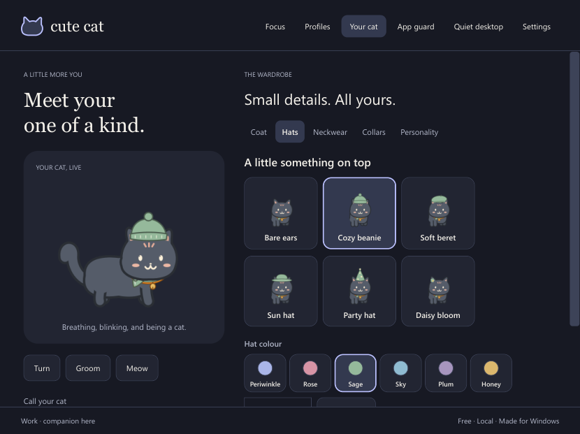

# Cute Cat

A free native Windows companion, drawn and animated continuously in C#. No sprite sheets, WebView, game engine or cloud service.

**v1.0.0** — Windows 11 x64.

## Install

Download **CuteCat-1.0.0-Setup.exe** from [GitHub Releases](https://github.com/kaustabhws/cute-cat/releases/tag/v1.0.0). The wizard adds Start menu/desktop shortcuts and registers the app in **Settings → Apps → Installed apps**. Uninstall removes the program and owned certificate trust while preserving your settings and focus history.

**Signing and readiness:** This 1.0.0 release still uses a protected self-signed development identity, not public publisher verification. The app, installer and uninstaller are signed and timestamped. To render above Windows notifications, the wizard asks to trust its certificate and enable UIAccess, which grants broader access to other apps’ controls. A normal GitHub release does not establish production readiness. Read the [access details](docs/16-uiaccess-review.md) and [production-release guide](docs/22-public-release-guide.md) before wider distribution.

## What it does

- Walks, runs, grooms, meows, plays, and turns with continuous code-driven animation.
- Naps when you are idle, with a breathing nose bubble and floating z symbols; stretches awake when you return.
- Offers real coat colours and a tabbed wardrobe with independently coloured hats, neckwear and collars you can combine. Presets and custom RGB colours are supported.
- Matches desktop apps you explicitly select. Choose a reminder or an angry paw that requests a normal window close, always or during focus sessions.
- Leaves save prompts and close refusals to you. Never force-kills a process.
- Dismisses supported Windows notifications after paw contact.
- Provides focus/break timers, local settings, charcoal/periwinkle themes, configurable native title-bar colours, rounded inputs and themed pet/tray menus.
- Keeps cat/tray menus visible even when Windows refuses focus, using a dedicated activatable menu window.
- Switches between Work, Study and Break profiles, with independent rules, activity and weekly schedules.
- Offers per-app temporary exceptions, close grace periods and daily allowances.
- Remembers a resting spot per monitor, settles while you work, and optionally moves away from a focused control.
- Adds ear twitches, a look before running, waking yawns and little completion celebrations.
- Verifies updates from GitHub and retains compatible signed installers for repair/rollback. Settings migrate with a preserved copy of the previous schema.

App guard starts off with no apps selected. Open **App guard → Add an app**, configure the rule, then enable it. Browser URL/tab detection is deferred. Unknown/system windows and unsupported close layouts are left alone.



## Develop

Requires Windows, PowerShell 7 and the .NET SDK in `global.json`.

```powershell
./scripts/build.ps1 -Publish
./scripts/get-inno-compiler.ps1
./scripts/prepare-uiaccess-review.ps1
./scripts/build-installer.ps1
```

The preparation step reuses a nonexportable signing key in the Windows user's CNG key store; it does not add trust or export the key. Packaging also requires Windows SDK SignTool and network access for timestamping. Publicly verified signing remains future work. GitHub Actions checks Windows Server 2022/2025; live Windows 11/RDP/multi-monitor tests are tracked separately.

The core, native adapters and renderer live in `src`; deterministic and native fixture checks live in `tests`. Diagnostic images are outputs, never runtime animation inputs. Build caches, personal configuration, user data, captures and signing keys are excluded from Git.

- [Getting started](docs/getting-started.md)
- [Build status and verification](docs/build-status.md)
- [Focus companion/customization contract](docs/18-focus-companion.md)
- [Profiles, privacy, updates and recovery](docs/19-profiles-and-reliability.md)
- [Coat colours, wardrobe and native theme](docs/20-appearance-and-theme.md)
- [Installer and uninstall contract](docs/17-windows-installer.md)
- [Production release guide](docs/22-public-release-guide.md)
- [Agent documentation map](docs/README.md)
- [Research and dated sources](docs/research/03-sources.md)
- [Third-party notices](docs/third-party-notices.md)
