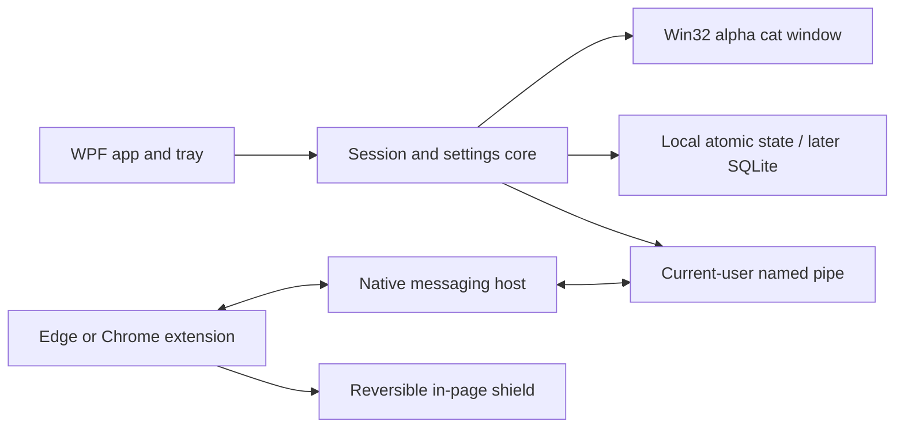

# Windows architecture

Recommended baseline: C# and .NET 10 LTS, WPF for ordinary UI, Win32 per-pixel-alpha overlay for the cat, and a Manifest V3 Edge/Chrome extension. See engineering sources T1–T14 in the [source register](research/03-sources.md).

Current 12 September implementation: C#/.NET 10, native WPF, original code-drawn geometry on a Win32 layered companion, atomic JSON and a scoped notification adapter. No sprite pipeline, WebView or runtime image service. See [the companion contract](13-companion-and-notifications.md). The extension/native host remain future work. Historical 0.2/0.3 claims were unsupported by files at task entry.

## Why this stack

Microsoft recommends WinUI 3 for new native apps. WPF is our project-specific choice for mature desktop windowing, fast custom XAML styling, accessibility, and straightforward Win32 integration. Excellent artwork and considered UI are not tied to one XAML framework. The cat window has unusual transparency/input requirements in either framework, so keep it behind a native adapter.

| Option | Strength | Tradeoff / decision |
| --- | --- | --- |
| WPF + small Win32 overlay | Mature .NET desktop surface; custom art and controls | Chosen; requires explicit visual design rather than default control styling |
| WinUI 3 + Win32 overlay | Microsoft's recommended new-app stack; modern controls | Good alternative if a future prototype shows a material UX benefit; extra window/runtime complexity now |
| Pure C++/Win32/Direct2D | Tight resource control | Higher implementation cost for forms, settings, accessibility, and persistence |
| Tauri / Electron | Web UI tooling and ecosystem | Does not meet the intended native UI direction as directly; unnecessary web runtime/window integration |
| Unity / Godot | Rich scene animation | Too much game-oriented runtime for this small utility |

Use the supported installed .NET 10 SDK; lock it in `global.json`. Its LTS support end was listed as 14 November 2028 when researched. Never copy an old version number from this plan without checking availability.

## Process and module boundaries

The desktop app owns sessions, protection pause, enabled rules, local summary, and companion state. The extension owns exact browser-document identity and applies/removes the shield in that document. The native host transports bounded messages and does not inspect pages or run arbitrary commands.

Initial implementation may use atomic JSON state with a bounded session history to keep the first local build dependency-light. SQLite is the planned migration if retention/reporting requires it. Do not ship two stores simultaneously. Preserve a schema version and explicit recovery path in either approach.

## Native companion window

- Use a small `WS_POPUP` layered tool window with `WS_EX_LAYERED | WS_EX_TOOLWINDOW | WS_EX_NOACTIVATE` and topmost placement. Ordinary control windows remain focusable.
- Supply premultiplied BGRA pixels with `UpdateLayeredWindow`. The current painter draws cubic paths directly into a persistent 32-bit PArgb DIB, reusing its DC and drawing resources; there are no PNG animation inputs. Do not mix `SetLayeredWindowAttributes` with this path.
- Fully transparent pixels pass clicks through to other apps. Do not rely on `HTTRANSPARENT` as a universal cross-process fix; its documented forwarding behavior is thread-limited.
- Do not use a desktop-sized invisible window. A shadow, if present, needs an independently click-through surface.
- Drag with window messages and signed screen coordinates; preserve foreground typing. Interactions should not inject global mouse/keyboard events.
- Observe monitor work areas and `WM_DPICHANGED`; account for negative coordinates, taskbar position, hot-unplug, and scale changes. Store relative parking information, not only raw pixels.
- Stop animation timers when hidden, locked, or static. Use held poses and low-frequency breathing; do not keep a 60 Hz loop alive unnecessarily.
- No reparenting into Explorer's undocumented WorkerW hierarchy in the initial build.

## Focus observation

An out-of-context `SetWinEventHook` can detect foreground app changes without injecting a DLL. Keep the callback alive, make callbacks short, and queue work. A message loop is required. App identity can be derived from the process path/package identity where available; inaccessible/elevated processes are skipped.

Do not read window titles or inspect arbitrary accessibility trees to infer browser URLs. No screenshot classifier or global keyboard hook is needed. A modest foreground polling adapter is acceptable in the initial build if measured and later replaced; document it rather than claiming event-driven behavior.

## Browser bridge

The extension connects using native messaging to an exact allowed extension origin. Native messages are length-prefixed UTF-8 JSON over stdin/stdout; stdout is protocol-only. The native host talks to a current-user-only named pipe. No listening HTTP port or cloud endpoint is needed.

Use a bounded protocol with request IDs, schema version, timeouts, input-length limits, and explicit disconnected responses. Only known message kinds are supported. Never accept shell commands, executable paths, arbitrary file requests, or URLs to open from the bridge.

Browser connections/profile instances are separate. A native host launched by a service worker may have `--parent-window=0`; do not pretend this identifies a Chrome HWND. The content script independently checks visibility, focus, and current route before showing a shield. It releases the shield on navigation, pause, permission loss, or expired connection lease.

## Packaging

Version 0.6.0 targets `net10.0-windows10.0.19041.0` to call supported WinRT notification APIs. Ordinary UI remains WPF and the cat remains Win32/GDI+. Community Toolkit Notifications 7.1.2 supplies only own-app toast creation/activation; its MIT notice ships with the package. Actual notification dismissal uses the bounded UIA close-control adapter, not a notification listener. Elevated launches are relaunched with standard-user privileges because Windows does not support app notifications from elevated processes.

The initial deliverable is a runnable local Windows build and portable distribution folder. A signed per-user installer is the public-release goal, not something to claim from `dotnet publish`. No signing certificate is provided by the user.

Native-host registration is per user under the Chrome and Edge `NativeMessagingHosts` keys, with an exact extension ID. It must be an explicit setup action; normal build scripts must not change browser registrations. Keep launch, register, and uninstall scripts separate and inspectable. Startup is off by default.

Release updates must verify signatures/version and avoid replacing assets during playback. Public signing, installer integration, store review, and auto-update remain distinct release tasks.

## Budgets to measure

Reference target: Windows 11 x64 laptop, 4+ cores, 8+ GB RAM, integrated graphics. These are targets, not results:

- Cat appears within 2 seconds of warm launch; cold startup target under 4 seconds.
- Idle CPU under 0.5% of total machine capacity over five minutes; active animation under 2% on the reference device.
- Background app target under 160 MB private working set; UI open under 220 MB. Record native hosts separately and as a total.
- Native cat surface target under 1 MiB at the tested default scale; measure larger display/size tiers separately. There is no sprite cache.
- Pause/quit/input response under 150 ms in ordinary operation; protection synchronization within a few seconds with honest disconnected status.

If budgets fail, profile decoded art and timer wakeups before changing frameworks. Retest high-DPI, multiple monitors, and integrated graphics; a single fast development machine is not sufficient release evidence.
