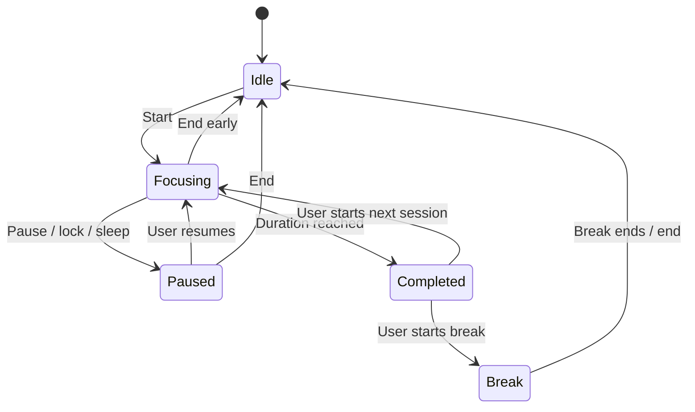

# Focus engine and intervention semantics

This document owns intended timing and policy. The first build may use a pull-based bridge: the extension asks for current session/rule state, decides only on its exact active document, and reports a confirmed shield. This avoids unsafe native guesses about browser tab identity.

## Session state

Protection pause is independent of timer pause. Effective protection requires Focusing, protection enabled, a matching enabled rule, a healthy adapter, and no exception. Breaks and paused sessions have no active shields.

Use monotonic elapsed time while running. Save accumulated focus time periodically and at every transition. Sleep/lock pauses rather than granting offline focus time. Recovery from an unclean exit is paused at the last checkpoint; never silently resume protection. Session completion is idempotent by session ID, so a restart cannot double-count it.

## Policy precedence

Evaluate in this order:

1. Disconnected, stopped, locked, paused, quiet-screen, or invalid state → release/no action.
2. Current temporary allowance → release/no action.
3. User disabled the specific rule or site permission missing → release/no action.
4. Exact supported feed rule matches → candidate.
5. Explicit whole-host rule matches → candidate.
6. Otherwise → no action.

Do not let a broad suggested preset override an explicit user allowance. Edits increment rule revision and cancel candidates. Exceptions are bounded by expiry and end with the session.

## URLs and coverage

Parse with the platform URL parser. Match canonical hostnames case-insensitively and paths according to the adapter's explicit rules. Never use `url.includes('youtube.com')`; it accepts lookalike hosts and query strings. Reject non-HTTP(S) schemes, credentials in entered rule URLs, invalid hostnames, extension/internal pages, and local/file URLs for the initial UI.

The Shorts adapter recognizes verified `/shorts/` routes on declared YouTube hosts. It must not match `/watch?v=…`, `/results`, or a different site's `?next=youtube.com/shorts/…`. `youtube.com.attacker.example` is not YouTube. Define whether bare and `www` hosts are included and test both.

Whole-site rules show the exact normalized host and whether subdomains are enabled. Instagram/TikTok whole-site presets must say whole site. A feed-specific claim requires separate verified route fixtures. Video IDs, query parameters, page titles, and page contents stay in the browser.

## Candidate and shield lifecycle

Default dwell: 4 seconds of continuous active, visible matching page. Tab/window blur or navigation resets dwell. A second active tab or same-process browser window must not inherit the old dwell.

At commit, re-evaluate current URL, visibility, focus, rule revision, session identity, and state lease. Content-script document state is the authority for the page it modifies. A stale host reply must not cause a shield after a navigation or session change.

Show an isolated, reversible in-page shield and pause standard HTML media where permitted. Do not navigate, close the tab, discard unsaved input, or remove the page DOM. Retain previous in-page focus and restore it if valid on removal. Media does not auto-resume.

The cat's notice/paw flourish is visual feedback. It must never be the source of a delayed destructive command. Hidden art or a dropped animation frame does not prevent the shield, and cancelling the session invalidates the shield independently.

Allow five minutes applies to the named host/rule in that browser profile for the active session. Expiry starts a fresh dwell. Escape performs the same allowance so the user does not encounter an immediate re-block loop. Pause protection is sent to the app and affects all connected browsers; while acknowledgement is pending, the local shield releases immediately.

Connection state is leased. Desktop status expires if the app stops responding. Service-worker disconnect, port closure, invalid JSON, protocol mismatch, or timeout returns a disconnected state. A page-side expiry timer removes a shield without depending on a suspended service worker. Browser timer throttling means this is best-effort voluntary friction, not a hard real-time guarantee.

## Concurrency and idempotency

- Native host framing maximum: 64 KiB application limit, lower than the browser maximum. Reject malformed lengths and unknown message kinds.
- Request IDs match responses; no uncontrolled global “last response.” Bound outstanding requests and timeouts.
- Browser/profile connections have ephemeral identifiers; do not persist complete browsing identifiers.
- Confirmed shield reports use an intervention ID. Deduplicate within a bounded recent-ID cache; do not count polls as interventions.
- No raw URL in the native protocol. Transmit rule IDs, action, session ID, and minimal aggregate status.
- A response for an old session or rule revision is discarded before modifying the page.
- Reconnect uses bounded backoff. Do not start an endless tight loop or repeatedly launch hidden app processes.

## Native app nudges

Match only selected executable/package identity. Require 10 seconds of foreground dwell and at least 2 minutes between nudges for the same app. A nudge has text and a dismiss/allow option; it never covers the app or terminates it. Skip own windows, shell/system surfaces, inaccessible processes, and secure desktops.

The initial product can ship browser protection before app nudges, but must record that narrower implementation status. Do not call a pet animation an app blocker.

## Required tests

State transitions, timer pause/resume, sleep-gap handling, crash recovery, duplicate completion, allowance expiry, valid/invalid host normalization, Shorts-vs-watch distinction, lookalike hosts, blur/navigation reset, stale response, disconnect cleanup, rule revision changes, duplicate shield reports, and empty/malformed/oversized native frames.

Use synthetic fixtures and test profiles. Test logic under deterministic clocks. A real Shorts smoke test supplements the fixture corpus but cannot replace it.
